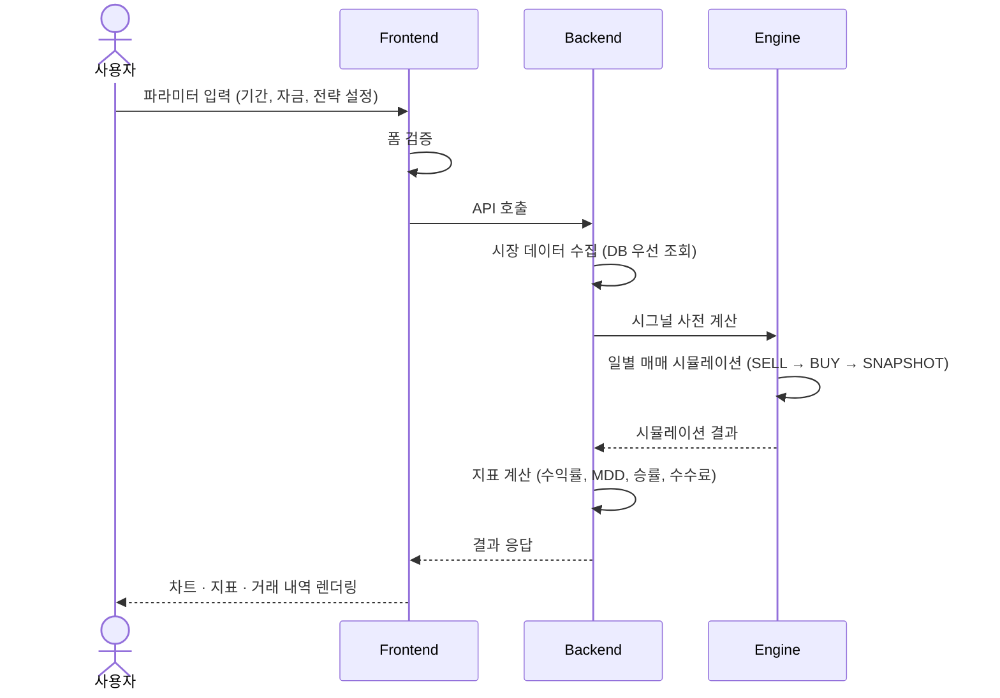
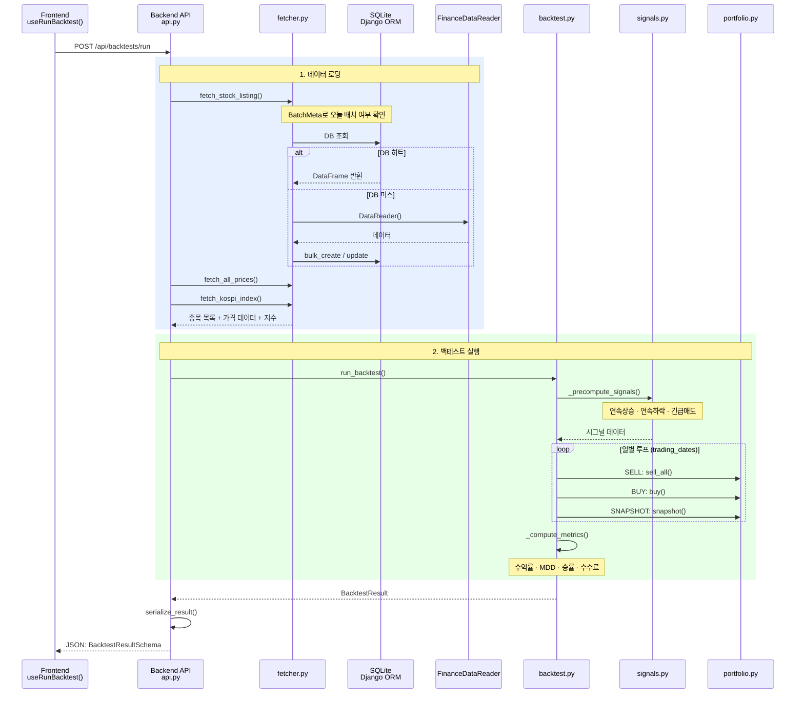

# Architecture

## Overview

프로젝트의 정식 이름은 "Stock Operating System"이다. `KOSPI`에 포함된 기업을 대상으로 추세 투자법을 기반으로 상승시 매수, 하락시 매도하는 전략을 시뮬레이션하고, 이를 통해 얻은 매직넘버를 이용하여 실제 거래를 실행하는 프로젝트이다. `FinanceDataReader`로 과거 데이터를 수집하고, 시그널 기반 백테스트 엔진으로 매매 전략을 시뮬레이션한 뒤, React 대시보드로 결과를 시각화한다. 실제 거래는 `한국투자증권 API`를 이용하여 실행하며, 이를 제어하기 위한 서비스의 계정 인증 및 거래 종목 관리는 `PocketBase`를 이용한다.

## Design Principles

1. **모듈화 · 재사용** — 구조적으로 작성하고 재사용 가능하게 모듈화하여 중복을 없앤다.
2. **Functional Programming** — 가독성과 테스트 용이성을 최우선 가치로 삼는다.
3. **비동기 + 친절한 UX** — 오래 걸리는 작업은 비동기 통신을 사용하고, 진행 상태를 사용자가 인지할 수 있는 UX를 제공한다.
4. **Zero Trust 보안** — 데이터 위변조를 철저히 검수하며, 로그인을 제외한 모든 화면은 인증/인가 확인 후 진행한다.
5. **레이어 분리** — 목적이 명확하고 경계가 분명한 레이어를 사용하되, 언어 및 서비스 타입(FE, BE, Batch 등)에 맞는 best practice를 따른다.
6. **최신 안정 스택** — 2026년 기준 최신의 가장 안정된 기술 스택과 구현 패턴을 채택한다.
7. **보수적 예외 처리** — 중복 처리 없이, 레이어별로 자신에게 필요한 예외 처리만 담당한다.

## Core Features & Workflows

### 핵심 기능

| 기능 | 설명 |
|------|------|
| 백테스트 시뮬레이션 | 파라미터 기반 추세 매매 전략 백테스트 실행 |
| 결과 시각화 | 자산 변동 차트, 벤치마크 비교, 거래 내역 테이블, 핵심 지표 카드 (수익률 · MDD · 승률 · 수수료) |
| 시장 데이터 수집 | KOSPI 종목의 과거 OHLCV 데이터 수집 및 DB 저장 |
| 종목 목록 조회 | KOSPI 상장 종목 목록 조회 API (시가총액 포함) |
| 실거래 연동 | 한국투자증권 API를 통한 실제 매매 실행 (예정) |

### 주요 워크플로우



매매 알고리즘 상세는 [algorithm.md](./05-algorithm.md)를 참고한다.

## Technology Stack

### Backend

| 기술 | 버전 | 용도 |
|------|------|------|
| Python | 3.12+ | 런타임 |
| Django | 5.1 | 웹 프레임워크 |
| django-ninja | 1.3 | REST API (FastAPI 스타일) |
| django-cors-headers | 4.4 | CORS 정책 관리 |
| FinanceDataReader | latest | 주가 · 시가총액 데이터 수집 |
| Pandas / NumPy | latest | 데이터 분석, 시뮬레이션 연산 |
| python-dotenv | 1.0 | 환경 변수 관리 |
| uv | latest | 패키지 · 프로젝트 관리 |

### Frontend

| 기술 | 버전 | 용도 |
|------|------|------|
| React | 19 | UI 라이브러리 |
| TypeScript | 5.9 | 타입 안전성 |
| Vite | 7 | 빌드 · 개발 서버 |
| TailwindCSS | 4 | 유틸리티 기반 스타일링 |
| shadcn/ui + Radix UI | latest | UI 컴포넌트 |
| Recharts | 3 | 차트 시각화 |
| Lightweight Charts | 5 | 금융 차트 시각화 (캔들스틱) |
| TanStack Query | 5 | 서버 상태 관리 |
| Zustand | 5 | 클라이언트 상태 관리 |
| React Hook Form + Zod | 7 / 4 | 폼 관리 · 유효성 검증 |
| Axios | 1 | HTTP 클라이언트 |

### Infrastructure

| 기술 | 용도 |
|------|------|
| Docker Compose | 로컬 개발 환경 오케스트레이션 |
| SQLite | 계정 관리, 시장 데이터 저장, 거래 종목 관리 (예정) |

## Data Flow

### 백테스트 실행 흐름



### 함수 호출 체인

```
api.run()
├── fetch_stock_listing("KOSPI")
│   ├── BatchMeta 확인 (오늘 배치 여부)
│   ├── _listing_from_db() 또는 fdr.StockListing()
│   └── _save_listing_to_db() → BatchMeta 갱신
├── fetch_all_prices(codes, start, end)
│   └── fetch_price_data(code, start, end)  # 종목별
│       ├── _price_from_db(code, start, end)
│       └── fdr.DataReader() → _save_price_to_db()
├── fetch_kospi_index()
│   ├── _price_from_db("KS11", start, end)
│   └── fdr.DataReader() → _save_price_to_db()
├── run_backtest(params, price_data, listing_df, index_df)
│   ├── _precompute_signals(price_data, n, m, y)
│   │   ├── detect_consecutive_rises(close, n)
│   │   ├── detect_consecutive_falls(close, m)
│   │   └── detect_emergency_sell(close, y)
│   ├── 일별 루프 (trading_dates)
│   │   ├── SELL: portfolio.sell_all()
│   │   ├── BUY:  portfolio.buy()
│   │   └── SNAP: portfolio.snapshot()
│   └── _compute_metrics(portfolio, initial_cash)
└── serialize_result(result) → JSON 응답
```

### 데이터 저장 전략

`fetcher.py`의 모든 데이터 수집 함수는 DB 우선 조회 후 미스 시 네트워크 fetch → DB 저장 패턴을 사용한다.

- **종목 목록**: `BatchMeta` 테이블로 하루 1회 배치 관리. 오늘 이미 fetch 했으면 DB 조회, 아니면 네트워크 fetch 후 DB upsert
- **일별 가격**: `StockDailyPrice` 테이블에 (code, date) 유니크 키로 저장. 요청 기간의 데이터가 DB에 완전히 있으면 DB 반환, 불완전하면 네트워크 fetch
- **KOSPI 지수**: 가격 데이터와 동일 테이블에 `is_index=True`로 구분하여 저장
- **fallback**: 종목 목록은 네트워크 실패 시 기존 DB 데이터 사용. 가격 데이터는 실패 시 예외 (시뮬레이션 불가)
- **네트워크 장애 대응**: `_retry()` 함수가 지수 백오프(1s → 2s → 4s)로 최대 3회 재시도

## Backend Layer Rules

```
config/  ← 외부 의존성 없음 (Django URL 라우팅만 apps 참조 허용)
core/    ← config만 의존. 순수 함수 + 콜백 수신. apps/django 모델 import 금지
apps/    ← config, core 의존. DB 접근·서비스 오케스트레이션 담당
```

1. **함수형 프로그래밍** — 외부 호출(네트워크, DB) 외에는 멱등성을 가진 순수 함수로 구현
2. **의존성 방향** — `config → core → apps` 단방향. 역방향 의존 금지
3. **1급 시민 함수** — DB 접근 등 부수 효과는 콜백으로 주입하여 core의 순수성 유지
4. **services 패턴** — `apps/*/services.py`에서 DB 콜백을 생성하고 core 함수에 주입

## Project Structure

```
lw-project-stock-simulator/
├── backend/                          # Django 백엔드 서비스
│   ├── apps/                         # Django 앱 모음
│   │   ├── backtests/                # 백테스트 API (api.py, schemas.py, serializers.py)
│   │   └── market_data/              # 시장 데이터 (models.py, services.py, api.py, schemas.py, admin.py)
│   ├── config/                       # Django 프로젝트 설정
│   │   ├── settings/                 # 환경별 설정 (base.py)
│   │   ├── urls.py                   # URL 라우팅
│   │   └── wsgi.py                   # WSGI 엔트리포인트
│   ├── core/                         # 핵심 비즈니스 로직 (Django 비의존)
│   │   ├── data/                     # 데이터 수집 (fetcher.py)
│   │   └── engine/                   # 매매 엔진 (backtest.py, portfolio.py, signals.py)
│   ├── tests/                        # 백엔드 테스트
│   ├── manage.py                     # Django CLI
│   ├── pyproject.toml                # Python 의존성·프로젝트 메타데이터
│   ├── Dockerfile                    # 백엔드 컨테이너 이미지
│   └── .env.example                  # 환경 변수 템플릿
├── frontend/                         # React 프론트엔드 서비스
│   ├── src/
│   │   ├── api/                      # API 클라이언트·타입 정의 (client.ts, types.ts)
│   │   ├── components/               # 공유 UI 컴포넌트
│   │   │   ├── ui/                   # shadcn/ui 기본 컴포넌트
│   │   │   ├── charts/               # 차트 컴포넌트
│   │   │   ├── forms/                # 폼 컴포넌트
│   │   │   ├── metrics/              # 지표 카드 컴포넌트
│   │   │   └── tables/               # 테이블 컴포넌트
│   │   ├── features/                 # 기능별 페이지 컴포넌트
│   │   │   └── backtest/             # 백테스트 대시보드·결과 화면
│   │   ├── hooks/                    # 커스텀 훅 (useBacktest.ts)
│   │   ├── lib/                      # 유틸리티 라이브러리 (utils.ts)
│   │   ├── utils/                    # 포매터·색상 유틸 (formatters.ts, colors.ts)
│   │   ├── App.tsx                   # 루트 컴포넌트
│   │   ├── main.tsx                  # 앱 엔트리포인트
│   │   └── index.css                 # 글로벌 스타일 (Tailwind)
│   ├── public/                       # 정적 에셋
│   ├── index.html                    # HTML 엔트리포인트
│   ├── vite.config.ts                # Vite 빌드 설정
│   ├── tsconfig.json                 # TypeScript 루트 설정
│   ├── eslint.config.js              # ESLint 설정
│   ├── components.json               # shadcn/ui 설정
│   ├── package.json                  # Node.js 의존성
│   └── Dockerfile                    # 프론트엔드 컨테이너 이미지
├── docs/                             # 프로젝트 문서
├── docker-compose.yml                # 로컬 개발 환경 오케스트레이션
├── CLAUDE.md                         # Claude Code 진입점 (문서 목차)
├── README.md                         # 프로젝트 소개
└── .gitignore                        # Git 제외 규칙
```

## Modules

### Backend Modules

| 모듈 | 역할 |
|------|------|
| `core/engine/backtest.py` | 일별 루프 기반 백테스트 시뮬레이션 실행 및 결과·지표 산출 |
| `core/engine/signals.py` | 종가 시리즈로부터 연속 상승·연속 하락·급락 매매 시그널을 감지하는 순수 함수 |
| `core/engine/portfolio.py` | 현금·보유종목·거래내역·일별 스냅샷 등 포트폴리오 상태 관리 및 매수·매도 실행 |
| `core/data/fetcher.py` | FinanceDataReader를 래핑하여 종목 가격·지수 데이터를 수집하는 순수 함수 (DB 콜백 주입) |
| `apps/backtests/api.py` | 백테스트 실행 POST 엔드포인트 — 데이터 수집·엔진 실행·결과 직렬화를 오케스트레이션 |
| `apps/backtests/schemas.py` | 백테스트 API 요청 파라미터와 응답 결과의 Pydantic(ninja) 스키마 정의 |
| `apps/backtests/serializers.py` | BacktestResult 데이터클래스를 JSON 직렬화 가능한 dict로 변환 |
| `apps/market_data/models.py` | 시장 데이터 Django 모델 (BatchMeta, StockListing, StockDailyPrice) |
| `apps/market_data/services.py` | DB 콜백 + core fetcher 조합 — 종목 목록/가격 데이터 DB 우선 조회 서비스 |
| `apps/market_data/api.py` | 상장 종목 목록 조회 GET 엔드포인트 (KOSPI 시가총액 포함) |
| `apps/market_data/schemas.py` | 종목 목록 응답의 Pydantic(ninja) 스키마 정의 |

### Frontend Modules

| 모듈 | 역할 |
|------|------|
| `api/client.ts` | Axios 인스턴스 생성 및 백테스트 실행 API 호출 함수 제공 |
| `api/types.ts` | 백테스트 요청·응답·거래·스냅샷·지수 등 API 타입 정의 |
| `features/backtest/BacktestDashboard.tsx` | 파라미터 폼과 결과 영역을 배치하는 백테스트 메인 레이아웃 컴포넌트 |
| `features/backtest/BacktestResults.tsx` | 지표 카드·자산 추이 차트·벤치마크 비교·거래 내역 탭을 구성하는 결과 표시 컴포넌트 |
| `hooks/useBacktest.ts` | TanStack Query의 useMutation으로 백테스트 API 호출 상태를 관리하는 커스텀 훅 |
| `utils/formatters.ts` | KRW 통화, 퍼센트, 날짜, 실행 시간 등 숫자·문자열 포매터 유틸리티 |
| `utils/colors.ts` | 한국 금융 컨벤션(상승 빨강·하락 파랑) 기반 차트·테이블 색상 상수 및 헬퍼 함수 |

## Infrastructure & Deployment

### Docker Compose 구성

| 서비스 | 이미지 | 포트 | 역할 |
|--------|--------|------|------|
| `backend` | `backend/Dockerfile` (`python:3.12-slim`) | 8000 | Django API 서버 |
| `frontend` | `frontend/Dockerfile` (`node:20-alpine`) | 5173 | Vite 개발 서버 |

- `frontend`는 `backend`에 의존한다 (`depends_on`)
- 개발 시 소스 바인드 마운트: `backend` → `./backend:/app`, `frontend` → `./frontend/src:/app/src`

### Dockerfile 빌드 과정

**Backend** (`python:3.12-slim`)

1. `build-essential` 설치 (네이티브 확장 빌드용)
2. `pyproject.toml` 복사 후 `uv pip install --system -e ".[dev]"` 로 의존성 설치
3. 소스 코드 복사 후 `python manage.py runserver 0.0.0.0:8000` 실행

**Frontend** (`node:20-alpine`)

1. `package.json` · `package-lock.json` 복사 후 `npm ci` 로 의존성 설치
2. 소스 코드 복사 후 `npm run dev -- --host 0.0.0.0` 실행

### 환경 변수

백엔드 환경 변수는 `backend/.env`로 관리한다. 템플릿: `backend/.env.example`

| 변수 | 기본값 | 설명 |
|------|--------|------|
| `SECRET_KEY` | `your-secret-key-here` | Django 시크릿 키 |
| `DEBUG` | `True` | Django 디버그 모드 |
| `ALLOWED_HOSTS` | `localhost,127.0.0.1` | 허용 호스트 목록 |
| `CORS_ALLOWED_ORIGINS` | `http://localhost:5173,http://localhost:3000` | CORS 허용 오리진 |

### 포트 매핑

| 서비스 | 호스트 | 컨테이너 |
|--------|--------|----------|
| Backend API | `localhost:8000` | `0.0.0.0:8000` |
| Frontend Dev | `localhost:5173` | `0.0.0.0:5173` |

